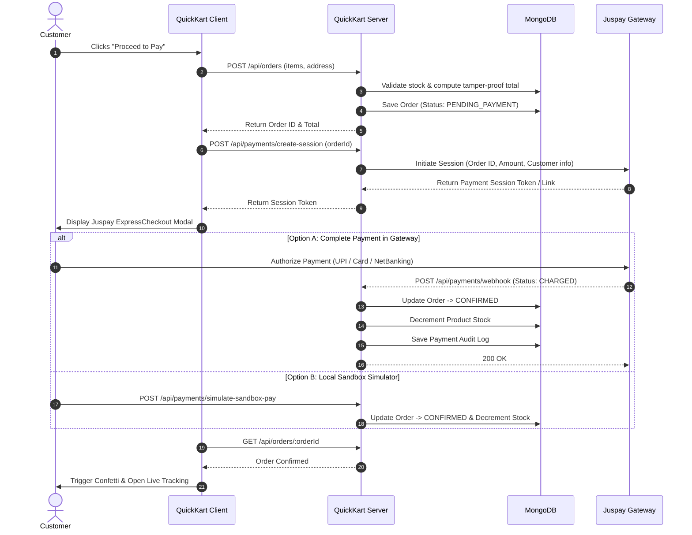
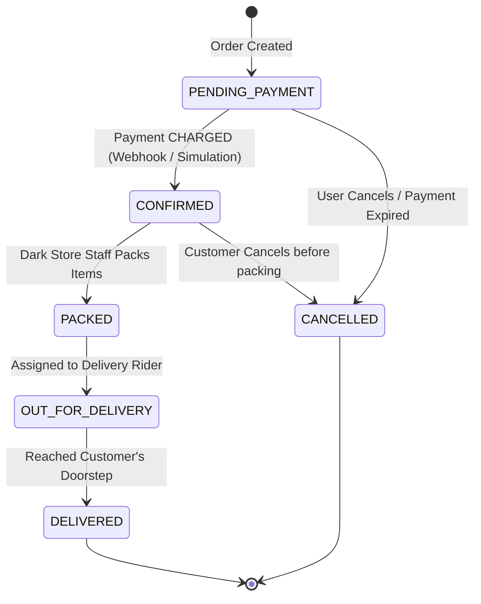

# ⚡ QuickKart — Full-Stack Quick Commerce & Juspay Integration

[](https://react.dev/)
[](https://vitejs.dev/)
[](https://nodejs.org/)
[](https://expressjs.com/)
[](https://www.mongodb.com/)
[](https://juspay.in/)
[](LICENSE)

> A modern, production-grade 10-minute quick-commerce web platform inspired by Blinkit and Zepto. Features catalog browsing, dynamic cart drawer with free delivery progress calculations, multi-address geocoding, server-side tamper-proof price reconciliation, **Juspay ExpressCheckout payment gateway integration with asynchronous webhooks**, live order tracking, and an administrative dark-store management dashboard.

---

## 📑 Table of Contents

- [Features Overview](#-features-overview)
- [Architecture & Tech Stack](#-architecture--tech-stack)
- [Project Directory Structure](#-project-directory-structure)
- [Juspay Payment Integration Flow](#-juspay-payment-integration-flow)
- [Order Lifecycle State Machine](#-order-lifecycle-state-machine)
- [Getting Started](#-getting-started)
  - [Prerequisites](#prerequisites)
  - [1. Backend Setup](#1-backend-setup)
  - [2. Frontend Setup](#2-frontend-setup)
- [Environment Configuration](#-environment-configuration)
- [Default Demo Credentials](#-default-demo-credentials)
- [REST API Reference](#-rest-api-reference)
- [Placement & Resume-Ready Section](#-placement--resume-ready-section)
- [Technical Interview Q&A](#-technical-interview-qa)
- [Future Enhancements](#-future-enhancements)
- [Author & Links](#-author)
- [License](#-license)

---

## ✨ Features Overview

### 🛒 Customer Storefront
- **Instant Category Browsing**: Smooth filtering across Dairy, Fruits & Vegetables, Snacks, Beverages, Instant Food, and Bakery.
- **Real-Time Instant Search**: Live multi-field query matching against product titles and categories.
- **Interactive Cart & Slide-out Drawer**:
  - Incremental quantity updates with stock ceiling validation.
  - Dynamic free delivery progress bar (qualifies above ₹199).
  - Clear bill breakdown: item subtotal, delivery fee, packaging charge, and grand total.
- **Multi-Address Management**: Add and switch between Home, Work, and Other addresses with geocoded labels.
- **10-Minute Delivery Experience**: Dynamic ETA indicator and dark-store proximity simulator.

### 💳 Juspay Payment Gateway Integration
- **Official SDK Integration**: Engineered with Juspay's `expresscheckout-nodejs` SDK.
- **Two-Phase Session Creation**: Secure server-side session initialization with customer tokens and unique `orderId`.
- **ExpressCheckout Modal**: Sleek gateway interface supporting UPI (Google Pay, PhonePe, Paytm), Credit/Debit Cards, Net Banking, and Wallets.
- **Asynchronous Webhook Reconciliation**: Server-to-server webhook endpoint (`/api/payments/webhook`) handling `CHARGED` and `PAYMENT_FAILED` events.
- **Automated Stock Deduction**: Inventory is atomically reserved and deducted upon verified payment confirmation.
- **Instant Sandbox Simulator**: Built-in 1-click sandbox payment simulator for local development without active merchant keys.

### 📦 Live Order Progression & Tracking
- **Step-by-Step Delivery Pipeline**: Visual progress tracker:
  `Order Placed` ➔ `Confirmed` ➔ `Packed` ➔ `Out for Delivery` ➔ `Delivered`.
- **Live Polling Updates**: Automatically refreshes order status every 4 seconds.
- **Order Cancellation**: In-app cancellation available while order is in `PENDING_PAYMENT` or `CONFIRMED` states.

### 🛠️ Dark Store Admin Operations
- **Store Performance Metrics**: Live counters for total orders, delivered volume, active catalog size, and gross platform revenue.
- **Order Dispatch Controller**: Advance orders through warehouse lifecycle stages in real time.
- **Catalog Management**: Add new items, update pricing and units, adjust stock levels, or toggle product visibility.

### 🔒 Enterprise Security & Resilience
- **Zero-Config Database**: Automatic fallback to embedded `mongodb-memory-server` if local MongoDB or MongoDB Atlas is offline.
- **Catalog Auto-Seeder**: Automatically seeds 19 quick-commerce products and demo accounts on startup.
- **Server-Side Price Authority**: Subtotals, packaging fees, and discounts are computed strictly from database records, preventing client-side cart tampering.
- **Role-Based Access Control (RBAC)**: Secure routes protected with JSON Web Tokens (JWT) and Bcrypt password hashing.

---

## 🏗️ Architecture & Tech Stack

```
┌────────────────────────────────────────────────────────┐
│                   QuickKart Client                     │
│          React 19 + Vite + Context API + CSS           │
└───────────────────────────┬────────────────────────────┘
                            │ REST APIs & JWT
┌───────────────────────────▼────────────────────────────┐
│                   QuickKart Backend                    │
│                 Node.js + Express 5                    │
│   ┌────────────────────────────────────────────────┐   │
│   │ Controllers (Auth, Product, Order, Payment)    │   │
│   │ Middleware (JWT Protect, RBAC, Error Handler)  │   │
│   │ Mongoose ODM (User, Product, Order, Payment)   │   │
│   └───────────────────────┬────────────────────────┘   │
└───────────────┬───────────┴─────────────────┬──────────┘
                │                             │
    ┌───────────▼────────────┐    ┌───────────▼───────────┐
    │     MongoDB Atlas      │    │    Juspay Gateway     │
    │  (or In-Memory Server) │    │  (ExpressCheckout)   │
    └────────────────────────┘    └───────────────────────┘
```

| Component | Technologies Used |
| :--- | :--- |
| **Frontend** | React 19, Vite, Lucide React (Icons), Canvas-Confetti, Modern Responsive CSS |
| **Backend** | Node.js (v18+), Express.js 5.2, CORS, Dotenv |
| **Database** | MongoDB, Mongoose 9.9, Embedded `mongodb-memory-server` (Zero-config fallback) |
| **Payment Gateway** | Juspay ExpressCheckout (`expresscheckout-nodejs` SDK) |
| **Authentication** | JSON Web Tokens (`jsonwebtoken`), Password Hashing (`bcrypt`), RBAC middleware |

---

## 📁 Project Directory Structure

```
quick-commerce-project/
├── client/                     # Frontend Application (React + Vite)
│   ├── public/                 # Static assets
│   ├── src/
│   │   ├── components/         # UI Components
│   │   │   ├── AdminDashboard.jsx  # Warehouse management & revenue stats
│   │   │   ├── AuthModal.jsx       # Login/Register with 1-click Demo buttons
│   │   │   ├── CartDrawer.jsx      # Slide-out bill & delivery progress
│   │   │   ├── JuspayModal.jsx     # ExpressCheckout payment modal
│   │   │   ├── LocationModal.jsx   # Multi-address selector
│   │   │   ├── Navbar.jsx          # Header with search & cart badges
│   │   │   ├── OrderTracking.jsx   # Real-time delivery progress timeline
│   │   │   └── ProductCard.jsx     # Card with +/- stock counters
│   │   ├── context/            # Global React State
│   │   │   ├── AuthContext.jsx     # Session, JWT, user roles
│   │   │   └── CartContext.jsx     # Cart items, drawer open/close, bill math
│   │   ├── services/           # Axios / Fetch API service abstractions
│   │   │   └── api.js
│   │   ├── App.jsx             # Main Application layout & routing
│   │   └── index.css           # Global design system & typography
│   ├── package.json
│   └── vite.config.js
│
├── server/                     # Backend API Server (Node.js + Express)
│   ├── config/
│   │   ├── db.js               # MongoDB connection with auto in-memory fallback
│   │   └── juspay.js           # Juspay SDK initialization
│   ├── controllers/            # Request handlers
│   │   ├── authController.js   # Register, login, address management
│   │   ├── orderController.js  # Order placement, status update, cancellation
│   │   ├── paymentController.js# Juspay session, webhooks, sandbox simulation
│   │   └── productController.js# Product listing, filtering, dark store inventory
│   ├── middleware/
│   │   ├── authMiddleware.js   # JWT authentication & role authorization
│   │   └── errorHandler.js     # Centralized error handler
│   ├── models/                 # Mongoose schemas
│   │   ├── Order.js            # Order schema & item snapshots
│   │   ├── Payment.js          # Juspay transaction logs
│   │   ├── Product.js          # Catalog schema & stock tracking
│   │   └── User.js             # User credentials & saved addresses
│   ├── routes/                 # Express API routes
│   │   ├── authRoutes.js
│   │   ├── orderRoutes.js
│   │   ├── paymentRoutes.js
│   │   └── productRoutes.js
│   ├── seed/
│   │   └── productsSeed.js     # 19 initial quick-commerce items & demo users
│   ├── .env.example            # Environment template
│   ├── package.json
│   └── server.js               # Server entry point
│
├── SRS_QuickKart.md            # Detailed Software Requirements Specification
├── WALKTHROUGH.md              # Architecture & Verification Walkthrough
└── README.md                   # Project documentation (this file)
```

---

## 💳 Juspay Payment Integration Flow



---

## 🔄 Order Lifecycle State Machine



---

## 🚀 Getting Started

### Prerequisites
- **Node.js**: v18.0.0 or higher ([Download Node.js](https://nodejs.org/))
- **npm**: v9.0.0 or higher
- *(Optional)* **MongoDB**: Local MongoDB service or MongoDB Atlas connection string. *(If left unconfigured, QuickKart automatically spins up an embedded in-memory database).*

---

### 1. Backend Setup

1. Open your terminal and navigate to the `server` folder:
   ```bash
   cd server
   ```

2. Install dependencies:
   ```bash
   npm install
   ```

3. Setup environment configuration:
   ```bash
   cp .env.example .env
   ```

4. Start the server:
   ```bash
   npm start
   ```
   The backend starts at `http://localhost:5000` with the following console output:
   ```text
   ✅ MongoDB Connected (or In-Memory MongoDB Connected)
   ⚡ Initializing catalog with sample quick-commerce products...
   Server running on port 5000
   ```

---

### 2. Frontend Setup

1. Open a second terminal window and navigate to the `client` folder:
   ```bash
   cd client
   ```

2. Install dependencies:
   ```bash
   npm install
   ```

3. Launch the Vite development server:
   ```bash
   npm run dev
   ```

4. Open [http://localhost:5173](http://localhost:5173) in your browser.

---

## ⚙️ Environment Configuration

### Backend (`server/.env`)

| Variable | Description | Default / Example Value |
| :--- | :--- | :--- |
| `PORT` | Port the Express server listens on | `5000` |
| `MONGO_URI` | MongoDB connection string (Atlas or local) | `mongodb://localhost:27017/quickkart` |
| `JWT_SECRET` | Secret key used to sign JWT tokens | `quickkart_super_secure_jwt_token_secret_key_2026` |
| `NODE_ENV` | Environment stage (`development` / `production`) | `development` |
| `APP_BASE_URL` | Frontend URL for CORS authorization | `http://localhost:5173` |
| `JUSPAY_MERCHANT_ID` | Juspay Merchant identifier | `sandbox_quickkart` |
| `JUSPAY_API_KEY` | Juspay API / Sub-account key | `sandbox_api_key_demo` |
| `JUSPAY_BASE_URL` | Juspay Gateway Endpoint | `https://sandbox.juspay.in` |
| `JUSPAY_CLIENT_ID` | Juspay Client ID | `quickkart_client` |

> [!TIP]
> **Zero-Config Database**: If `MONGO_URI` is blank or unreachable, QuickKart starts an embedded `mongodb-memory-server` in the background with auto-seeded demo data.

---

## 🔑 Default Demo Credentials

You can log in directly using the **1-Click Demo Buttons** inside the Login Modal, or manually enter:

| Role | Email | Password | Capabilities |
| :--- | :--- | :--- | :--- |
| **Customer** | `customer@quickkart.com` | `customer123` | Add to cart, choose address, pay with Juspay, track live delivery |
| **Admin** | `admin@quickkart.com` | `admin123` | Dark store inventory, change stock/pricing, view revenue, advance order stages |

---

## 📡 REST API Reference

### Authentication (`/api/auth`)
| Method | Endpoint | Access | Description |
| :--- | :--- | :--- | :--- |
| `POST` | `/api/auth/register` | Public | Register a new customer account |
| `POST` | `/api/auth/login` | Public | Authenticate user and receive JWT |
| `GET` | `/api/auth/me` | Protected | Fetch current logged-in user profile & addresses |
| `POST` | `/api/auth/address` | Protected | Add a new delivery address |
| `DELETE` | `/api/auth/address/:addressId` | Protected | Remove a saved delivery address |

### Products & Catalog (`/api/products`)
| Method | Endpoint | Access | Description |
| :--- | :--- | :--- | :--- |
| `GET` | `/api/products` | Public | List products (supports `category` and `search` query params) |
| `GET` | `/api/products/categories` | Public | Get distinct list of product categories |
| `GET` | `/api/products/:id` | Public | Get single product detail |
| `POST` | `/api/products` | Admin | Create a new catalog product |
| `PUT` | `/api/products/:id` | Admin | Update price, stock, or active status |
| `DELETE` | `/api/products/:id` | Admin | Delete a product from the catalog |

### Orders (`/api/orders`)
| Method | Endpoint | Access | Description |
| :--- | :--- | :--- | :--- |
| `POST` | `/api/orders` | Protected | Place a new order (calculates server-side total) |
| `GET` | `/api/orders/my-orders` | Protected | Retrieve all orders placed by the current user |
| `GET` | `/api/orders/:identifier` | Protected | Fetch order by MongoDB `_id` or unique `orderId` |
| `POST` | `/api/orders/:id/cancel` | Protected | Cancel an order in `PENDING_PAYMENT` or `CONFIRMED` state |
| `GET` | `/api/orders` | Admin / Staff | List all platform orders for warehouse dispatch |
| `PUT` | `/api/orders/:id/status` | Admin / Staff | Update order stage (`PACKED`, `OUT_FOR_DELIVERY`, `DELIVERED`) |

### Payments & Juspay (`/api/payments`)
| Method | Endpoint | Access | Description |
| :--- | :--- | :--- | :--- |
| `POST` | `/api/payments/create-session` | Protected | Initiate Juspay checkout session for an order |
| `POST` | `/api/payments/webhook` | Gateway | Asynchronous webhook receiving status from Juspay |
| `POST` | `/api/payments/verify-status` | Protected | Fallback client reconciliation endpoint |
| `POST` | `/api/payments/simulate-sandbox-pay`| Public | Instant sandbox payment completion for dev/demo |

---

## 💼 Placement & Resume-Ready Section

Use these bullet points for campus placements, software developer internships, or full-stack engineering applications:

### Option 1: Bullet Points for Software Engineer / Full-Stack Role
```text
QuickKart — Quick Commerce & Payment Processing Web Platform (MERN Stack)
• Engineered a full-stack 10-minute grocery delivery web platform using React 19, Node.js, Express, and MongoDB.
• Integrated Juspay ExpressCheckout SDK supporting UPI, Cards, and Net Banking; built asynchronous webhook listeners to achieve idempotent order confirmation and automated stock reservation.
• Designed server-side price calculation and tamper-proofing logic, preventing client-side cart manipulation.
• Built an interactive dark-store admin panel enabling store managers to update live inventory stock and advance order lifecycle states (Pending → Confirmed → Packed → Out for Delivery → Delivered).
• Implemented JWT authentication, role-based access control (RBAC), and zero-configuration in-memory database fallback for instant local evaluation.
```

### Option 2: Short 3-Line Summary (For Single-Page Resume)
```text
QuickKart | MERN Stack, Juspay Gateway, JWT, React 19 | GitHub: github.com/Rohit-pal01/quick-commerce-project
• Developed a responsive quick-commerce web application with real-time order tracking and dark-store inventory control.
• Implemented end-to-end payment processing with Juspay ExpressCheckout SDK, webhook handling, and atomic stock updates.
• Built secure RESTful APIs with JWT authentication, server-side cart validation, and zero-config in-memory database fallback.
```

---

## 🎯 Technical Interview Q&A

<details>
<summary><b>1. How did you handle security and prevent users from tampering with product prices in the frontend?</b></summary>

> **Answer:** The frontend only submits `productId` and `quantity` to `POST /api/orders`. The backend fetches the official prices directly from MongoDB, recalculates the subtotal, delivery charges, and packaging fee on the server, and establishes the order record. The client has zero control over the payable amount.
</details>

<details>
<summary><b>2. Why did you integrate Juspay instead of standard Razorpay or Stripe?</b></summary>

> **Answer:** Juspay is the underlying checkout infrastructure powering top Indian quick-commerce and delivery giants (such as Swiggy and Zepto). Working with Juspay ExpressCheckout provided direct hands-on experience with production-grade payment orchestration, server-to-server session tokens, and cryptographic webhook reconciliation.
</details>

<details>
<summary><b>3. What happens if the customer completes payment but closes their browser before returning?</b></summary>

> **Answer:** The payment confirmation does not depend on the browser. Juspay triggers an asynchronous server-to-server Webhook notification (`CHARGED`) directly to `/api/payments/webhook`. The server processes this notification, transitions the order to `CONFIRMED`, and decrements inventory in MongoDB. When the customer logs back in, their order is already confirmed.
</details>

<details>
<summary><b>4. How does the database fallback work?</b></summary>

> **Answer:** In `server/config/db.js`, the server attempts to connect to `process.env.MONGO_URI` with a 3-second timeout. If the database is unreachable or omitted, it gracefully falls back to `mongodb-memory-server` and triggers automatic seeding of products and demo users. This allows anyone to clone and run the application instantly without setup friction.
</details>

---

## 📈 Future Enhancements

- [ ] Real-time rider geocoding using Socket.io and Leaflet / Google Maps.
- [ ] Redis caching for high-throughput product catalog queries.
- [ ] SMS / WhatsApp order status notifications using Twilio API.
- [ ] Mobile companion app built with React Native.

---

## 👨‍💻 Author

**Rohit Pal**  
- **GitHub:** [@Rohit-pal01](https://github.com/Rohit-pal01)  
- **Project Repository:** [quick-commerce-project](https://github.com/Rohit-pal01/quick-commerce-project)  

---

## 📄 License

This project is licensed under the [ISC License](LICENSE).
