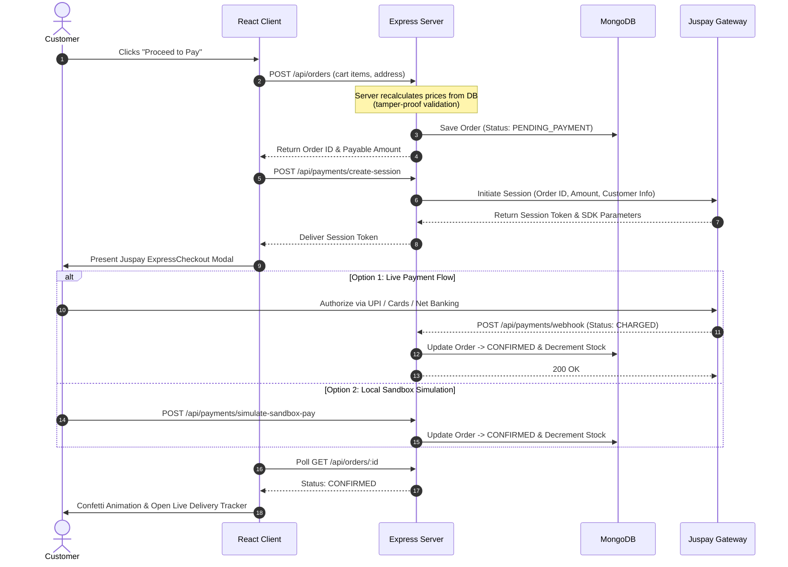
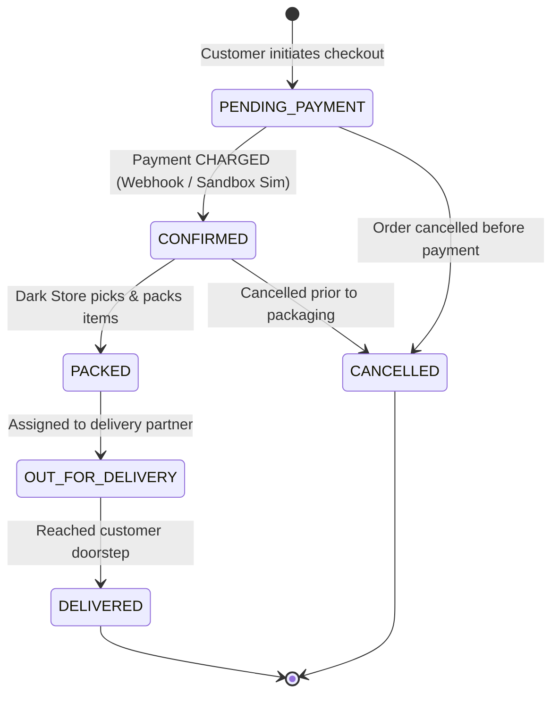

<div align="center">

# ⚡ QuickKart

### *Ultra-Fast 10-Minute Quick Commerce Engine & Juspay Integration*

[](https://react.dev/)
[](https://vitejs.dev/)
[](https://nodejs.org/)
[](https://expressjs.com/)
[](https://www.mongodb.com/)
[](https://juspay.in/)

<p align="center">
  <b>A full-stack quick-commerce platform inspired by Blinkit & Zepto.</b><br>
  Built with end-to-end catalog discovery, real-time cart bill calculations, multi-address geocoding,<br>
  <b>Juspay ExpressCheckout payment gateway</b> with asynchronous webhook reconciliation, live order progression, and a dark-store warehouse dashboard.
</p>

<p align="center">
  <a href="#-quick-start">Quick Start</a> •
  <a href="#-key-features">Key Features</a> •
  <a href="#-system-architecture">Architecture</a> •
  <a href="#-juspay-payment-lifecycle">Juspay Flow</a> •
  <a href="#-resume--interview-guide">Interview Guide</a> •
  <a href="#-api-specifications">API Specs</a>
</p>

---

</div>

## 🌟 Key Highlights

<table>
  <tr>
    <td width="50%">
      <h3>⚡ 10-Minute Hyperlocal Storefront</h3>
      <ul>
        <li><b>Instant Catalog:</b> Multi-category filtering across Dairy, Produce, Snacks, Beverages, Bakery, and Instant Meals.</li>
        <li><b>Dynamic Cart Engine:</b> Real-time stock cap validation, threshold-based free delivery tracker (₹199), and itemized fee breakdown.</li>
        <li><b>Multi-Address Hub:</b> Manage tagged addresses (Home, Work, Other) with instant active selector.</li>
      </ul>
    </td>
    <td width="50%">
      <h3>💳 Juspay ExpressCheckout Integration</h3>
      <ul>
        <li><b>Enterprise Payment Gateway:</b> Integrated via official <code>expresscheckout-nodejs</code> SDK.</li>
        <li><b>Multi-Rail Checkout:</b> Seamless support for UPI (GPay, PhonePe, Paytm), Credit/Debit Cards, and Net Banking.</li>
        <li><b>Asynchronous Webhooks:</b> Server-to-server cryptographic reconciliation with automated inventory decrement on <code>CHARGED</code> events.</li>
      </ul>
    </td>
  </tr>
  <tr>
    <td width="50%">
      <h3>📦 Real-Time Order Dispatch Pipeline</h3>
      <ul>
        <li><b>State Machine:</b> <code>Pending</code> ➔ <code>Confirmed</code> ➔ <code>Packed</code> ➔ <code>Out for Delivery</code> ➔ <code>Delivered</code>.</li>
        <li><b>Live Progress Tracker:</b> Visual timeline polling every 4 seconds for immediate warehouse updates.</li>
        <li><b>Self-Serve Cancellation:</b> Safe cancellation before fulfillment kicks off.</li>
      </ul>
    </td>
    <td width="50%">
      <h3>🏪 Dark-Store Admin Operations</h3>
      <ul>
        <li><b>Inventory Management:</b> Live stock adjustments, pricing controls, and catalog toggle directly from the warehouse view.</li>
        <li><b>Lifecycle Dispatcher:</b> Advance customer orders through packing, dispatch, and delivery stages.</li>
        <li><b>Business Metrics:</b> Live metrics tracking total orders, completed volume, active SKUs, and gross revenue.</li>
      </ul>
    </td>
  </tr>
</table>

---

## 🏛️ System Architecture

```
┌─────────────────────────────────────────────────────────────────┐
│                    QuickKart Web Client                         │
│       React 19 • Vite • Context API • Lucide React • CSS3       │
└──────────────────────────────┬──────────────────────────────────┘
                               │ JSON REST APIs (JWT Bearer)
┌──────────────────────────────▼──────────────────────────────────┐
│                   Node.js & Express 5 API Server                │
│  ┌───────────────────────────────────────────────────────────┐  │
│  │ Controllers: Auth • Products • Orders • Payments          │  │
│  │ Middleware: JWT Protect • RBAC Guard • Central Error Log  │  │
│  │ Security: Server-side Price Verification & Tamper Defense │  │
│  └───────────────────────────┬───────────────────────────────┘  │
└──────────────┬───────────────┴─────────────────┬────────────────┘
               │                                 │
     ┌─────────▼──────────┐            ┌─────────▼──────────┐
     │   MongoDB Atlas    │            │   Juspay Gateway   │
     │  (or Embedded DB)  │            │  (ExpressCheckout) │
     └────────────────────┘            └────────────────────┘
```

### Core Technology Stack

| Domain | Technology | Purpose |
| :--- | :--- | :--- |
| **Frontend** | React 19, Vite, Lucide Icons | Responsive UI, single-page reactive state, fast bundling |
| **Backend** | Node.js, Express.js 5.2 | High-throughput REST API server, webhook listeners |
| **Database** | MongoDB, Mongoose 9.9 | Document store with schemas, validation, and auto-seeding |
| **Fallback DB** | `mongodb-memory-server` | Zero-configuration embedded database for instant local evaluation |
| **Payments** | Juspay ExpressCheckout SDK | Server session initiation, webhooks, and payment reconciliation |
| **Security** | JWT, Bcrypt | Cryptographic authentication, password hashing, and RBAC |

---

## 💳 Juspay Payment Lifecycle

The sequence below illustrates how QuickKart orchestrates secure payments, webhook validation, and inventory reservations:



---

## 🔄 Order Lifecycle State Machine



---

## 🚀 Quick Start

### Prerequisites
- **Node.js**: v18.0.0 or later ([Download Node](https://nodejs.org/))
- **npm**: v9.0.0 or later
- *(Optional)* **MongoDB**: Local MongoDB or MongoDB Atlas URI. *(QuickKart includes an embedded in-memory MongoDB that starts automatically if no URI is provided).*

---

### Step 1: Clone the Repository
```bash
git clone https://github.com/Rohit-pal01/quickkart.git
cd quickkart
```

### Step 2: Start Backend Server
```bash
cd server
npm install
npm start
```
> The server will boot at `http://localhost:5000`. If no local MongoDB is running, it automatically starts the embedded in-memory MongoDB and seeds 19 quick-commerce items and demo users.

### Step 3: Start Frontend Client
In a new terminal window:
```bash
cd client
npm install
npm run dev
```
> Open [http://localhost:5173](http://localhost:5173) in your browser.

---

## 🔑 Demo Access Accounts

For instant testing, use the **1-Click Demo** buttons inside the login popup, or enter:

| Role | Email | Password | Allowed Capabilities |
| :--- | :--- | :--- | :--- |
| 🛍️ **Customer** | `customer@quickkart.com` | `customer123` | Add products, switch addresses, checkout with Juspay, live order tracking |
| 🏪 **Store Admin** | `admin@quickkart.com` | `admin123` | Real-time dark-store inventory control, price updates, order dispatch status transitions |

---

## ⚙️ Environment Configuration

Copy the sample environment file in `server/`:
```bash
cp server/.env.example server/.env
```

| Key | Description | Default / Example Value |
| :--- | :--- | :--- |
| `PORT` | Port for Express API server | `5000` |
| `MONGO_URI` | MongoDB Connection URI *(Optional)* | `mongodb://localhost:27017/quickkart` |
| `JWT_SECRET` | Secret key for signing JWT tokens | `quickkart_super_secure_jwt_token_secret_key_2026` |
| `NODE_ENV` | Environment state | `development` |
| `APP_BASE_URL` | Frontend origin for CORS authorization | `http://localhost:5173` |
| `JUSPAY_MERCHANT_ID` | Juspay merchant identifier | `sandbox_quickkart` |
| `JUSPAY_API_KEY` | Juspay API / Sub-account key | `sandbox_api_key_demo` |
| `JUSPAY_BASE_URL` | Juspay gateway endpoint | `https://sandbox.juspay.in` |

---

## 📡 API Specifications

<details>
<summary><b>🔍 Click to Expand REST API Reference</b></summary>
<br>

### Authentication Endpoints (`/api/auth`)
- `POST /api/auth/register` — Create a new customer profile.
- `POST /api/auth/login` — Authenticate credentials and retrieve JWT bearer token.
- `GET  /api/auth/me` — Retrieve active session profile and saved addresses *(Protected)*.
- `POST /api/auth/address` — Save a delivery address *(Protected)*.
- `DELETE /api/auth/address/:addressId` — Delete a saved delivery address *(Protected)*.

### Catalog Endpoints (`/api/products`)
- `GET  /api/products` — Filter products by `category` or `search` query.
- `GET  /api/products/categories` — Retrieve distinct category listing.
- `GET  /api/products/:id` — Fetch detailed product profile.
- `POST /api/products` — Create new inventory SKU *(Admin only)*.
- `PUT  /api/products/:id` — Update stock levels, price, or visibility *(Admin only)*.
- `DELETE /api/products/:id` — Delete product from catalog *(Admin only)*.

### Order Operations (`/api/orders`)
- `POST /api/orders` — Place order with server-calculated tamper-proof total *(Protected)*.
- `GET  /api/orders/my-orders` — List current customer's order history *(Protected)*.
- `GET  /api/orders/:identifier` — Get order status by MongoDB ID or readable `orderId` *(Protected)*.
- `POST /api/orders/:id/cancel` — Cancel pending/confirmed order *(Protected)*.
- `GET  /api/orders` — View global warehouse orders *(Admin & Delivery Staff)*.
- `PUT  /api/orders/:id/status` — Transition order state *(Admin & Delivery Staff)*.

### Payment & Webhook Operations (`/api/payments`)
- `POST /api/payments/create-session` — Initiate Juspay ExpressCheckout session *(Protected)*.
- `POST /api/payments/webhook` — Asynchronous server-to-server gateway callback.
- `POST /api/payments/verify-status` — Fallback status reconciliation endpoint *(Protected)*.
- `POST /api/payments/simulate-sandbox-pay` — Instant local sandbox payment simulation.

</details>

---

## 💼 Resume & Interview Guide

### 📄 Resume Bullet Points

#### Option A: Full-Stack / Software Development Engineer (Recommended)
```text
QuickKart — 10-Minute Quick Commerce Platform (MERN Stack & Juspay Gateway)
• Built a full-stack quick-commerce web application using React 19, Node.js, Express 5, and MongoDB.
• Integrated Juspay ExpressCheckout SDK with server-to-server webhook handling for asynchronous reconciliation and atomic stock deduction.
• Implemented server-side cart calculation and tamper-proof price verification to prevent client-side cart tampering.
• Developed a dark-store warehouse dashboard enabling real-time stock management and order dispatch lifecycle transitions.
• Architected a zero-configuration fallback using an embedded in-memory MongoDB instance with automatic catalog seeding.
```

#### Option B: 3-Line Summary (For Compact Resumes)
```text
QuickKart | React 19, Node.js, Express, MongoDB, Juspay SDK | GitHub: github.com/Rohit-pal01/quickkart
• Built a full-stack quick-commerce application featuring instant search, dynamic cart drawers, and live order tracking.
• Implemented end-to-end payment processing with Juspay ExpressCheckout, webhook validation, and inventory reservations.
• Designed role-based authentication (JWT/Bcrypt), server-side price security, and zero-config in-memory database fallback.
```

---

### 🎯 Technical Interview Questions & Answers

<details>
<summary><b>1. How do you prevent client-side price tampering?</b></summary>

> **Answer:** The frontend never sends prices to the server. The checkout payload only contains `productId` and `quantity`. The backend fetches canonical product records directly from MongoDB, calculates line totals, adds packaging and delivery fees, and generates the final payable amount on the server.
</details>

<details>
<summary><b>2. Why integrate Juspay ExpressCheckout instead of standard redirect gateways?</b></summary>

> **Answer:** Juspay powers checkout infrastructure for high-scale platforms like Swiggy and Zepto. It provides higher UPI conversion rates through native intent routing, server-to-server session tokens, and webhook reconciliation, minimizing dropped checkouts in quick-commerce flows.
</details>

<details>
<summary><b>3. What happens if a user pays but closes their tab before returning?</b></summary>

> **Answer:** Payment confirmation does not rely on the client browser. Juspay dispatches an asynchronous webhook (`CHARGED`) directly to the backend. The server validates the callback, marks the order as `CONFIRMED`, and decrements inventory in MongoDB. When the customer logs back in, their order is already updated.
</details>

<details>
<summary><b>4. How does the zero-config database fallback work?</b></summary>

> **Answer:** The database connection module (`server/config/db.js`) attempts to connect to `MONGO_URI` with a 3-second timeout. If unreachable or unconfigured, it dynamically spawns an in-memory MongoDB instance using `mongodb-memory-server` and triggers catalog auto-seeding, enabling immediate zero-friction evaluation.
</details>

---

## 📈 Future Enhancements

- [ ] **Rider Geolocation Tracking**: Live rider tracking on Leaflet / Mapbox using WebSockets (Socket.io).
- [ ] **High-Performance Caching**: Redis caching layer for top-searched categories and catalog items.
- [ ] **Customer Notifications**: Delivery updates via WhatsApp / SMS using Twilio.
- [ ] **Mobile Client**: Native iOS and Android companion apps built with React Native.

---

## 👨‍💻 Author

**Rohit Pal**  
- **GitHub**: [@Rohit-pal01](https://github.com/Rohit-pal01)  
- **Repository**: [quickkart](https://github.com/Rohit-pal01/quickkart)  

---

## 📄 License

This project is licensed under the [ISC License](LICENSE).
