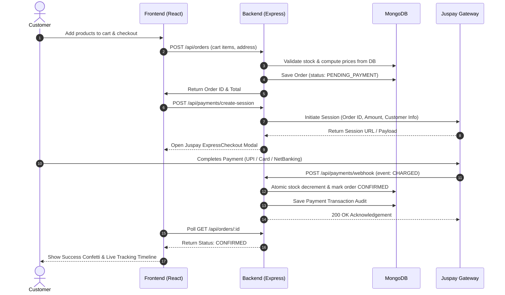

# ⚡ QuickKart — Full-Stack Quick Commerce Platform

<div align="center">


**A high-performance, 10-minute grocery delivery web application built with the MERN stack and integrated with the Juspay ExpressCheckout payment gateway.**

[Features](#-key-features) • [Architecture](#-architecture--system-design) • [Quick Start](#-quick-start-guide) • [Juspay Integration](#-juspay-payment-integration) • [API Reference](#-api-endpoints) • [Demo Credentials](#-demo-accounts)

</div>

---

## 📖 Overview

**QuickKart** is a production-ready Quick Commerce (q-commerce) platform inspired by industry leaders like Blinkit, Zepto, and Swiggy Instamart. It delivers groceries and daily essentials within minutes through a network of local dark stores (micro-fulfillment warehouses).

The project features a **tamper-proof shopping experience**, complete with server-side price verification, atomic inventory management, an administrative dark-store command center, and enterprise-grade payment processing through the **Juspay ExpressCheckout SDK**.

---

## ✨ Key Features

### 🛒 Customer Storefront
- **⚡ 10-Minute Delivery Promise**: Dynamic ETA indicators and live delivery status badge.
- **🔍 Instant Search & Categorized Catalog**: Browse categories (Dairy & Bread, Fresh Produce, Snacks, Cold Drinks, Instant Food, Personal Care).
- **🛍️ Smart Cart Drawer**: 
  - Dynamic Free Delivery progress meter (Free shipping over ₹199).
  - Accurate bill breakdown (Item Total, Delivery Fee, Handling Charge, Total Amount).
- **📍 Multi-Address Management**: Save multiple delivery locations with geolocation tags (Home, Work, Hub).
- **🎉 Interactive Celebrations**: Real-time canvas-confetti on successful payment and delivery.
- **⏱️ Live Order Tracking**: Multi-stage progress tracking with order cancellation and polling updates.

### 💳 Juspay ExpressCheckout Integration
- **SDK Powered**: Built using official `expresscheckout-nodejs` SDK.
- **Session-Based Checkout**: Secure server-to-server payment session initialization.
- **Diverse Payment Options**: UPI (Intent & Collect), Credit/Debit Cards, and Net Banking.
- **Robust Webhooks**: Asynchronous server-to-server callback processing with idempotency.
- **Payment Reconciliation Fallback**: Active status verification for network interruption recovery.
- **🛠️ Built-In Sandbox Simulator**: Seamless testing environment without requiring live bank authorization.

### 🛡️ Enterprise Security & Data Integrity
- **Tamper-Proof Pricing**: Product totals, delivery fees, and discounts are calculated strictly on the backend from verified database records.
- **Atomic Stock Management**: Inventory is checked before order creation and decremented atomically upon confirmed payment.
- **Role-Based Access Control (RBAC)**: JWT-secured endpoints separating `customer`, `admin`, and `delivery` roles.
- **Password Security**: Passwords hashed with `bcrypt`.

### 🏪 Admin & Dark Store Command Center
- **Live Inventory Manager**: Real-time stock adjustment, active/inactive toggles, and catalog updates.
- **Order State Machine**: Manual/automatic status progressions (`PENDING_PAYMENT` ➔ `CONFIRMED` ➔ `PACKED` ➔ `OUT_FOR_DELIVERY` ➔ `DELIVERED`).
- **Revenue Analytics**: Real-time sales metrics, active order counters, and order distribution tracking.

### 🚀 Zero-Config Resilient Database
- **Automatic Fallback**: Connects to MongoDB Atlas / local MongoDB, with an automatic fallback to an embedded in-memory database (`mongodb-memory-server`) if external connections are unreachable.
- **Instant Auto-Seeding**: Automatically seeds essential products and admin accounts on first launch.

---

## 🏗️ Architecture & System Design

```
                     ┌───────────────────────────────┐
                     │   React 19 + Vite Frontend    │
                     │  (Storefront, Admin, Cart)    │
                     └──────────────┬────────────────┘
                                    │ HTTP / REST
                                    ▼
                     ┌───────────────────────────────┐
                     │   Node.js / Express Backend   │
                     │   - JWT Auth & RBAC           │
                     │   - Order State Engine        │
                     │   - Price & Stock Validator   │
                     └──────┬─────────────────┬──────┘
                            │                 │
              Mongoose ODM  │                 │ Juspay Node.js SDK
                            ▼                 ▼
          ┌───────────────────┐    ┌───────────────────────────┐
          │  MongoDB Database │    │ Juspay Payment Gateway    │
          │  (Atlas / Memory) │    │  - Session Management     │
          │                   │    │  - Asynchronous Webhooks  │
          └───────────────────┘    │  - Status Reconciliation  │
                                   └───────────────────────────┘
```

### 🔄 End-to-End Order & Payment Flow



---

## 📁 Repository Structure

```
quick-commerce-project/
├── client/                         # Frontend Application (React + Vite)
│   ├── src/
│   │   ├── components/
│   │   │   ├── AdminDashboard.jsx  # Dark store inventory & order control
│   │   │   ├── AuthModal.jsx       # Login/Register with 1-click demo buttons
│   │   │   ├── CartDrawer.jsx      # Slide-out cart with bill & fee breakdown
│   │   │   ├── JuspayModal.jsx     # ExpressCheckout payment modal
│   │   │   ├── LocationModal.jsx   # Multi-address management modal
│   │   │   ├── Navbar.jsx          # Header with location, search, cart count
│   │   │   ├── OrderTracking.jsx   # Live order progress & cancellation
│   │   │   └── ProductCard.jsx     # Quantity counter & out-of-stock badge
│   │   ├── context/
│   │   │   ├── AuthContext.jsx     # User authentication state
│   │   │   └── CartContext.jsx     # Persistent cart state & calculations
│   │   ├── services/
│   │   │   └── api.js              # Centralized API service layer
│   │   ├── App.jsx                 # Root UI component & navigation tabs
│   │   ├── index.css               # Design tokens, variables & styling
│   │   └── main.jsx                # Vite entry point
│   ├── .env.example                # Frontend environment template
│   └── package.json
│
├── server/                         # Backend Application (Node.js + Express)
│   ├── config/
│   │   ├── db.js                   # MongoDB connection & in-memory fallback
│   │   └── juspay.js               # Juspay SDK configuration
│   ├── controllers/
│   │   ├── authController.js       # Auth, profiles, and addresses
│   │   ├── orderController.js      # Orders & state transitions
│   │   ├── paymentController.js    # Sessions, webhooks, verification
│   │   └── productController.js    # Catalog management
│   ├── middleware/
│   │   ├── authMiddleware.js       # JWT validation & role authorization
│   │   └── errorHandler.js         # Centralized error handler
│   ├── models/
│   │   ├── Order.js                # Order schema & lifecycle states
│   │   ├── Payment.js              # Gateway transaction logs
│   │   ├── Product.js              # Inventory schema
│   │   └── User.js                 # User accounts & address book
│   ├── routes/
│   │   ├── authRoutes.js           # /api/auth routes
│   │   ├── orderRoutes.js          # /api/orders routes
│   │   ├── paymentRoutes.js        # /api/payments routes
│   │   └── productRoutes.js        # /api/products routes
│   ├── seed/
│   │   └── productsSeed.js         # Comprehensive 35+ item seed catalog
│   ├── .env.example                # Backend environment template
│   ├── package.json
│   └── server.js                   # Express server entry point
│
├── SRS_QuickKart.md                # Full Software Requirements Specification
├── WALKTHROUGH.md                  # Implementation walkthrough & testing log
└── README.md                       # Main documentation
```

---

## ⚡ Quick Start Guide

### Prerequisites
- [Node.js](https://nodejs.org/) (version 18 or higher)
- [npm](https://www.npmjs.com/) (version 9 or higher)

### 1. Clone the Repository
```bash
git clone https://github.com/your-username/quick-commerce-project.git
cd quick-commerce-project
```

### 2. Configure Environment Variables

#### Backend Configuration:
Create `server/.env` (or copy from `server/.env.example`):
```bash
# In server directory
PORT=5000
NODE_ENV=development
APP_BASE_URL=http://localhost:5173

# Database Connection (Leave empty or use Atlas string; in-memory runs if omitted)
MONGO_URI=mongodb+srv://<username>:<password>@cluster0.mongodb.net/quickkart

# JWT Token Secret
JWT_SECRET=quickkart_super_secure_jwt_token_secret_key_2026

# Juspay ExpressCheckout Sandbox Credentials
JUSPAY_MERCHANT_ID=sandbox_quickkart
JUSPAY_API_KEY=sandbox_api_key_demo
JUSPAY_BASE_URL=https://sandbox.juspay.in
JUSPAY_CLIENT_ID=quickkart_client
```

#### Frontend Configuration:
Create `client/.env` (or copy from `client/.env.example`):
```bash
# In client directory
VITE_API_BASE_URL=http://localhost:5000/api
```

### 3. Install Dependencies

```bash
# Install Server Dependencies
cd server
npm install

# Install Client Dependencies
cd ../client
npm install
```

### 4. Seed Product Catalog (Optional)
The server auto-seeds sample items upon initial boot. To populate the complete 35+ quick commerce product catalog:
```bash
cd server
npm run seed
```

### 5. Start the Application

#### Terminal 1 — Start the Backend:
```bash
cd server
npm start
# Server starts on http://localhost:5000
```

#### Terminal 2 — Start the Frontend:
```bash
cd client
npm run dev
# Vite runs on http://localhost:5173
```

Open [http://localhost:5173](http://localhost:5173) in your browser.

---

## 👥 Demo Accounts

The login dialog provides convenient **1-Click Demo Buttons** to switch roles instantly:

| Role | Email | Password | Allowed Actions |
| :--- | :--- | :--- | :--- |
| **Customer** | `customer@quickkart.com` | `customer123` | Browse catalog, manage cart, place orders, complete checkout via Juspay, track delivery |
| **Admin** | `admin@quickkart.com` | `admin123` | Manage dark store inventory, update stock levels, toggle availability, transition order states, view analytics |

---

## 💳 Juspay Payment Integration

QuickKart implements standard Juspay ExpressCheckout flows:

### Integration Features:
1. **Session Creation (`/api/payments/create-session`)**:
   Initiates a payment session with Juspay by passing the unique order ID, currency (`INR`), amount, customer details, and callback URLs.
2. **Asynchronous Webhooks (`/api/payments/webhook`)**:
   Listens for server-to-server events (`CHARGED`, `PAYMENT_FAILED`). When `CHARGED` is received, the system confirms the order and decrements inventory in MongoDB.
3. **Status Verification (`/api/payments/verify-status`)**:
   A fallback polling route used when a client loses internet connectivity during the payment redirect.
4. **Sandbox Payment Simulator (`/api/payments/simulate-sandbox-pay`)**:
   Allows testing payment success/failure directly without connecting live banking credentials.

---

## 📡 API Endpoints

### Authentication (`/api/auth`)
| Method | Endpoint | Access | Description |
| :--- | :--- | :--- | :--- |
| `POST` | `/api/auth/register` | Public | Register customer account |
| `POST` | `/api/auth/login` | Public | Authenticate user & retrieve JWT |
| `GET` | `/api/auth/me` | Protected | Fetch current profile & saved addresses |
| `POST` | `/api/auth/address` | Protected | Add new delivery address with coordinates |
| `DELETE` | `/api/auth/address/:addressId` | Protected | Remove saved address |

### Catalog & Products (`/api/products`)
| Method | Endpoint | Access | Description |
| :--- | :--- | :--- | :--- |
| `GET` | `/api/products` | Public | Fetch products (with category, search, filter) |
| `GET` | `/api/products/categories` | Public | Get distinct product categories |
| `GET` | `/api/products/:id` | Public | Fetch single product details |
| `POST` | `/api/products` | Admin | Create a new catalog product |
| `PUT` | `/api/products/:id` | Admin | Update product details & inventory stock |
| `DELETE` | `/api/products/:id` | Admin | Soft/hard delete product |

### Orders (`/api/orders`)
| Method | Endpoint | Access | Description |
| :--- | :--- | :--- | :--- |
| `POST` | `/api/orders` | Customer | Create order & lock pending state |
| `GET` | `/api/orders/my-orders` | Customer | List authenticated user's order history |
| `GET` | `/api/orders/:identifier` | Customer/Staff | Get detailed order status & timeline |
| `POST` | `/api/orders/:id/cancel` | Customer/Staff | Cancel order (if not yet dispatched) |
| `GET` | `/api/orders` | Admin/Staff | Get all dark store orders |
| `PUT` | `/api/orders/:id/status` | Admin/Staff | Advance order stage (`CONFIRMED` ➔ `PACKED` ➔ `DELIVERED`) |

### Payments (`/api/payments`)
| Method | Endpoint | Access | Description |
| :--- | :--- | :--- | :--- |
| `POST` | `/api/payments/create-session` | Protected | Create Juspay ExpressCheckout session |
| `POST` | `/api/payments/webhook` | Public | Receive Juspay server-to-server status events |
| `POST` | `/api/payments/verify-status` | Protected | Reconcile payment status fallback |
| `POST` | `/api/payments/simulate-sandbox-pay` | Public | Simulate sandbox payment completion |

---

## 🧪 Testing & Validation

Run the following checks to verify project integrity:

```bash
# Verify backend syntax
cd server
node --check server.js
node --check seed/productsSeed.js

# Verify frontend build
cd ../client
npm run build
```

---

## 🛠️ Tech Stack & Libraries

- **Frontend**: React 19, Vite, Lucide React (Icons), Canvas-Confetti, Vanilla CSS Variables.
- **Backend**: Node.js, Express.js 5, JSON Web Token (JWT), bcrypt.
- **Database**: MongoDB, Mongoose 9, MongoDB-Memory-Server.
- **Payment Gateway**: Juspay ExpressCheckout (`expresscheckout-nodejs`).

---

## 📜 Documentation References

- [SRS_QuickKart.md](SRS_QuickKart.md) — Complete IEEE 830 style specification document.
- [WALKTHROUGH.md](WALKTHROUGH.md) — Implementation verification and walkthrough guide.

---

## 📄 License

This project is licensed under the [ISC License](LICENSE).
