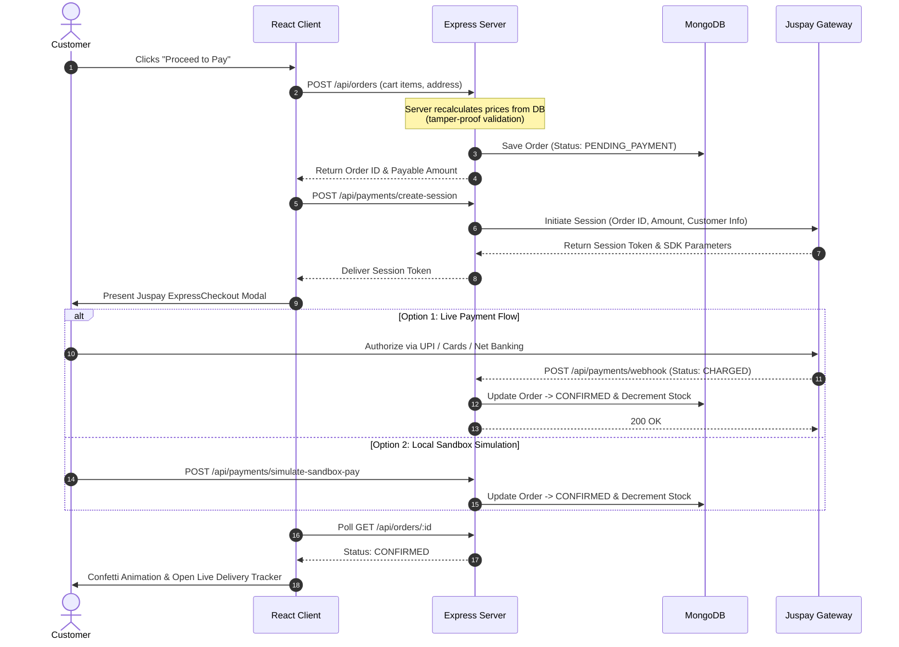
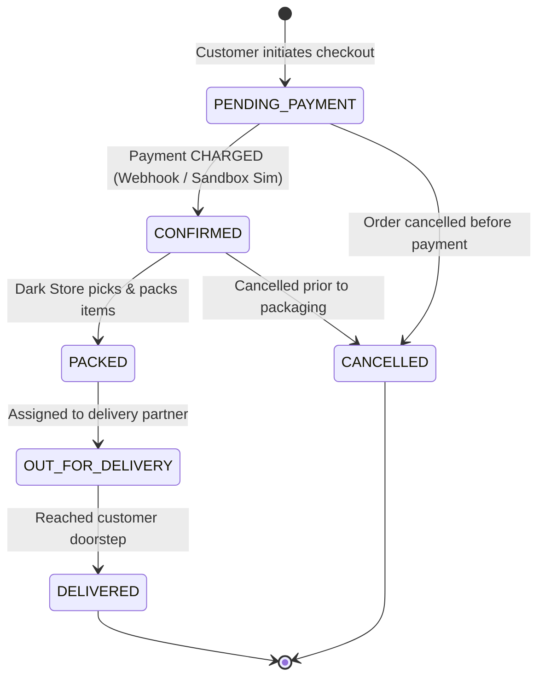

<div align="center">

# ⚡ QuickKart

### *Ultra-Fast 10-Minute Hyperlocal Quick Commerce & Juspay Integration*

[](https://quickkartservice.vercel.app)
[](https://react.dev/)
[](https://vitejs.dev/)
[](https://nodejs.org/)
[](https://expressjs.com/)
[](https://www.mongodb.com/)
[](https://juspay.in/)

<p align="center">
  <b>A production-grade, full-stack quick-commerce platform inspired by Blinkit & Zepto.</b><br>
  Engineered with sub-second catalog discovery, server-verified tamper-proof cart calculations, persistent <b>Dark Mode</b>,<br>
  <b>Juspay ExpressCheckout</b> with cryptographic webhook reconciliation, live order progression state machine, and an executive <b>Dark Store & Admin Operations Hub</b>.
</p>

<p align="center">
  <a href="https://quickkartservice.vercel.app"><b>🌐 View Live Demo</b></a> •
  <a href="#-quick-start">Quick Start</a> •
  <a href="#-key-features">Key Features</a> •
  <a href="#-system-architecture">Architecture</a> •
  <a href="#-juspay-payment-lifecycle">Juspay Flow</a> •
  <a href="#-resume--interview-guide">Interview Guide</a> •
  <a href="#-api-specifications">API Specs</a>
</p>

---

</div>

## 🌟 Key Features & Highlights

<table>
  <tr>
    <td width="50%">
      <h3>⚡ 10-Minute Hyperlocal Storefront</h3>
      <ul>
        <li><b>Instant Catalog Discovery:</b> Real-time filtering across Dairy & Breakfast, Fruits & Vegetables, Snacks & Munchies, Beverages, Instant Food, Chocolates, and Home Essentials.</li>
        <li><b>Dynamic Cart Engine:</b> Real-time stock cap validation, threshold-based free delivery tracker (₹199), and itemized fee breakdown.</li>
        <li><b>Smart Address Geocoding:</b> Mandatory address onboarding at signup; auto-links default address to cart and delivery ETA header pill.</li>
        <li><b>🌙 Premium Dark Mode:</b> System-preference auto-detection, persistent local theme storage, and high-contrast midnight aesthetics.</li>
      </ul>
    </td>
    <td width="50%">
      <h3>💳 Juspay ExpressCheckout Integration</h3>
      <ul>
        <li><b>Enterprise Payment Orchestration:</b> Integrated via official <code>expresscheckout-nodejs</code> SDK.</li>
        <li><b>Multi-Rail Checkout:</b> Seamless support for UPI (GPay, PhonePe, Paytm), Credit/Debit Cards, and Net Banking.</li>
        <li><b>Cryptographic Webhooks:</b> Server-to-server reconciliation with automated inventory decrement on <code>CHARGED</code> events.</li>
        <li><b>Sandbox Payment Simulator:</b> Instant 1-click fallback payment verification for development and demo evaluations.</li>
      </ul>
    </td>
  </tr>
  <tr>
    <td width="50%">
      <h3>📦 Real-Time Order Dispatch Pipeline</h3>
      <ul>
        <li><b>Strict State Machine:</b> <code>PENDING_PAYMENT</code> ➔ <code>CONFIRMED</code> ➔ <code>PACKED</code> ➔ <code>OUT_FOR_DELIVERY</code> ➔ <code>DELIVERED</code>.</li>
        <li><b>Live Delivery Tracker:</b> Animated timeline polling every 4 seconds for instant dark store updates.</li>
        <li><b>Self-Serve Cancellation:</b> Safe order cancellation allowed before warehouse packing begins.</li>
      </ul>
    </td>
    <td width="50%">
      <h3>🏪 Dark Store & Admin Operations Hub</h3>
      <ul>
        <li><b>Live Warehouse Dispatcher:</b> Glowing neon status transition controls for advancing orders in real-time.</li>
        <li><b>Inventory SKU Control:</b> Real-time stock increments, price edits, and new item creation directly into the catalog.</li>
        <li><b>👥 Customer Management Center:</b> View all registered customer profiles, join dates, default delivery addresses, and manage account deletions with self-lockout protection.</li>
        <li><b>Business Performance Metrics:</b> Live dashboard cards tracking Gross Revenue, Active Deliveries, Total Orders, and Active SKUs.</li>
      </ul>
    </td>
  </tr>
</table>

---

## 🏛️ System Architecture

```
┌─────────────────────────────────────────────────────────────────┐
│                    QuickKart Web Client                         │
│   React 19 • Vite • Context API (Auth, Cart, Theme) • CSS3     │
│   Features: Responsive UI • Instant Search • Midnight Dark Mode │
└──────────────────────────────┬──────────────────────────────────┘
                               │ JSON REST APIs (JWT Bearer Auth)
┌──────────────────────────────▼──────────────────────────────────┐
│                   Node.js & Express 5 API Server                │
│  ┌───────────────────────────────────────────────────────────┐  │
│  │ Controllers: Auth • Products • Orders • Payments          │  │
│  │ Middleware: JWT Protect • RBAC Guard • Central Error Log  │  │
│  │ Security: Server-side Price Verification & Tamper Defense │  │
│  └───────────────────────────┬───────────────────────────────┘  │
└──────────────┬───────────────┴─────────────────┬────────────────┘
               │                                 │
     ┌─────────▼──────────┐            ┌─────────▼──────────┐
     │   MongoDB Atlas    │            │   Juspay Gateway   │
     │  (or Embedded DB)  │            │  (ExpressCheckout) │
     └────────────────────┘            └────────────────────┘
```

### Core Technology Stack

| Layer | Technology | Purpose |
| :--- | :--- | :--- |
| **Frontend** | React 19, Vite, Lucide React | Single-page reactive application, instant component rendering |
| **State & Theming** | React Context API, CSS Variables | Global Cart, Auth, and Dark/Light Theme with `localStorage` persistence |
| **Backend** | Node.js (v20+), Express.js 5.2 | Scalable REST API micro-architecture, webhook listeners, RBAC guards |
| **Database** | MongoDB Atlas, Mongoose 9.9 | Production document store with schema validation, indexes, and auto-seeding |
| **Zero-Config DB** | `mongodb-memory-server` | Automatic embedded in-memory database fallback for instant local evaluation |
| **Payments** | Juspay ExpressCheckout SDK | Server session initiation, webhook verification, and payment reconciliation |
| **Authentication** | JWT (JSON Web Tokens), Bcrypt | Cryptographic token sessions, salted password hashing, and role authorization |
| **Hosting** | Vercel (Client) + Render/Node | Production cloud deployment with automated CI/CD git hooks |

---

## 💳 Juspay Payment Lifecycle

The sequence below illustrates how QuickKart orchestrates secure payments, webhook validation, and inventory reservations:



---

## 🔄 Order Lifecycle State Machine



---

## 🚀 Quick Start (Local Setup)

### Prerequisites
- **Node.js**: v18.0.0 or later ([Download Node.js](https://nodejs.org/))
- **npm**: v9.0.0 or later
- **Git**: Installed on your system

> 💡 **Windows PowerShell Tip:** If script execution is blocked on Windows, run this once:  
> `Set-ExecutionPolicy -Scope CurrentUser -ExecutionPolicy RemoteSigned`

---

### Step 1: Clone the Repository
```bash
git clone https://github.com/Rohit-pal01/quickkart.git
cd quickkart
```

### Step 2: Start Backend Server
```bash
cd server
npm install
npm run dev
```
> The server runs on `http://localhost:5000`. If no external MongoDB URI is provided, it automatically boots an embedded in-memory MongoDB and seeds demo grocery products and users.

### Step 3: Start Frontend Client
In a **new terminal tab**:
```bash
cd client
npm install
npm run dev
```
> Open [http://localhost:5173](http://localhost:5173) in your browser.

---

## 🔑 Access Accounts & Live Website

| Portal / Role | Email | Password | Privileges & Notes |
| :--- | :--- | :--- | :--- |
| 🌐 **Live Website Link** | — | — | **[https://quickkartservice.vercel.app](https://quickkartservice.vercel.app)** |
| 👑 **Store Owner (Real Admin)** | `admin@quickkart.com` | `admin123` | **Full Administrative Control:** Add/edit products, change Veg/Non-Veg dietary badges, update prices, delete items, restore catalog, manage orders. |
| 🛡️ **Public Demo Admin** | `demo.admin@quickkart.com` | `demo123` | **Read-Only Demo Mode:** Inspect Dark Store Hub, view live orders, analytics, and stock without risk of altering store data. |
| 🛍️ **Customer Account** | `customer@quickkart.com` | `customer123` | Browse catalog, add to cart, test Dark Mode, checkout via Juspay, track live 8-min delivery. |

---

## ⚙️ Environment Configuration

Copy the sample environment file in `server/`:
```bash
cp server/.env.example server/.env
```

| Key | Description | Default / Example Value |
| :--- | :--- | :--- |
| `PORT` | Port for Express API server | `5000` |
| `MONGO_URI` | MongoDB Atlas Connection URI | `mongodb+srv://<user>:<password>@cluster0.mongodb.net/quickkart` |
| `JWT_SECRET` | Secret key for signing JWT tokens | `quickkart_super_secure_jwt_token_secret_key_2026` |
| `NODE_ENV` | Environment state | `development` |
| `APP_BASE_URL` | Frontend origin for CORS authorization | `http://localhost:5173` |
| `JUSPAY_MERCHANT_ID` | Juspay merchant identifier | `sandbox_quickkart` |
| `JUSPAY_API_KEY` | Juspay API / Sub-account key | `sandbox_api_key_demo` |
| `JUSPAY_BASE_URL` | Juspay gateway endpoint | `https://sandbox.juspay.in` |

For frontend (`client/.env`):
```env
VITE_API_BASE_URL=http://localhost:5000/api
```

---

## 📡 API Specifications

<details>
<summary><b>🔍 Click to Expand Complete REST API Reference</b></summary>
<br>

### Authentication & User Management (`/api/auth`)
- `POST   /api/auth/register` — Create customer account (requires `name`, `email`, `phone`, `password`, `address`).
- `POST   /api/auth/login` — Authenticate user and return JWT bearer token.
- `GET    /api/auth/me` — Retrieve active authenticated user profile *(Protected)*.
- `GET    /api/auth/users` — Retrieve all registered users and customers *(Admin only)*.
- `DELETE /api/auth/users/:id` — Delete a user account with self-deletion protection *(Admin only)*.
- `POST   /api/auth/address` — Add a new tagged delivery address *(Protected)*.
- `DELETE /api/auth/address/:addressId` — Delete a delivery address *(Protected)*.

### Product Catalog (`/api/products`)
- `GET    /api/products` — List catalog products with search, category, and stock filters.
- `GET    /api/products/categories` — Get distinct category taxonomy list.
- `GET    /api/products/:id` — Get single product details.
- `POST   /api/products` — Create new grocery SKU *(Admin only)*.
- `PUT    /api/products/:id` — Update stock levels, price, or description *(Admin only)*.
- `DELETE /api/products/:id` — Remove SKU from active store *(Admin only)*.

### Orders Pipeline (`/api/orders`)
- `POST   /api/orders` — Create new order with server-calculated tamper-proof line totals *(Protected)*.
- `GET    /api/orders/my-orders` — View authenticated user's order history *(Protected)*.
- `GET    /api/orders/:identifier` — Fetch order details by MongoDB ID or readable `orderId` *(Protected)*.
- `POST   /api/orders/:id/cancel` — Cancel pending/confirmed order *(Protected)*.
- `GET    /api/orders` — View global dark store orders *(Admin only)*.
- `PUT    /api/orders/:id/status` — Transition order lifecycle state *(Admin only)*.

### Payment & Webhooks (`/api/payments`)
- `POST   /api/payments/create-session` — Create Juspay ExpressCheckout payment session *(Protected)*.
- `POST   /api/payments/webhook` — Asynchronous server-to-server gateway callback listener.
- `POST   /api/payments/verify-status` — Fallback status reconciliation endpoint *(Protected)*.
- `POST   /api/payments/simulate-sandbox-pay` — Instant local sandbox payment simulation.

</details>

---

## 💼 Resume & Technical Interview Guide

### 📄 Resume Bullet Points

```text
QuickKart — 10-Minute Hyperlocal Quick Commerce Platform (MERN Stack & Juspay Gateway)
• Engineered a full-stack quick-commerce application using React 19, Vite, Node.js, Express 5, and MongoDB Atlas.
• Integrated Juspay ExpressCheckout SDK with cryptographic server-to-server webhook reconciliation and atomic stock decrement on payment settlement.
• Implemented server-side price validation to prevent client-side cart tampering and enforce threshold-based free delivery rules.
• Built a dark-store warehouse operations dashboard featuring live order lifecycle state transitions, SKU management, and customer administration.
• Designed a persistent Dark Mode theme engine with system-preference detection and zero-config in-memory MongoDB fallback.
```

---

### 🎯 Technical Interview Questions & Answers

<details>
<summary><b>1. How do you prevent client-side cart and price tampering?</b></summary>

> **Answer:** The frontend never transmits prices or bill totals to the server. The checkout payload only contains `productId` and `quantity`. The backend fetches canonical product records directly from MongoDB, calculates item subtotals, validates available stock, calculates packaging and delivery fees, and establishes the authoritative payable amount on the server before initiating any payment session.
</details>

<details>
<summary><b>2. Why choose Juspay ExpressCheckout over traditional redirect gateways?</b></summary>

> **Answer:** Juspay powers checkout infrastructure for top quick-commerce enterprises like Swiggy and Zepto. It maximizes conversion rates through native UPI intent routing, eliminates multi-hop redirects, provides secure server-to-server session tokens, and ensures robust payment verification via asynchronous webhooks.
</details>

<details>
<summary><b>3. What happens if a customer completes payment but closes the tab immediately?</b></summary>

> **Answer:** Order confirmation does not depend on the browser. Juspay dispatches an asynchronous `CHARGED` webhook directly to our backend server. The server verifies the cryptographic payload, updates the order status to `CONFIRMED`, and decrements stock in MongoDB. When the customer re-opens their app, their order is already confirmed and being packed.
</details>

<details>
<summary><b>4. How does the Role-Based Access Control (RBAC) protect dark-store routes?</b></summary>

> **Answer:** All administrative routes are protected by a two-tier middleware pipeline (`protect` and `authorize('admin')`). The token is cryptographically verified via JWT, and the user's role is checked against the database. Customers cannot access warehouse dispatching, customer records, or SKU creation endpoints.
</details>

---

## 👨‍💻 Author

**Rohit Pal**  
- **GitHub**: [@Rohit-pal01](https://github.com/Rohit-pal01)  
- **Repository**: [quickkart](https://github.com/Rohit-pal01/quickkart)  
- **Live Deployment**: [quickkartservice.vercel.app](https://quickkartservice.vercel.app)

---

## 📄 License

This project is licensed under the [ISC License](LICENSE).
